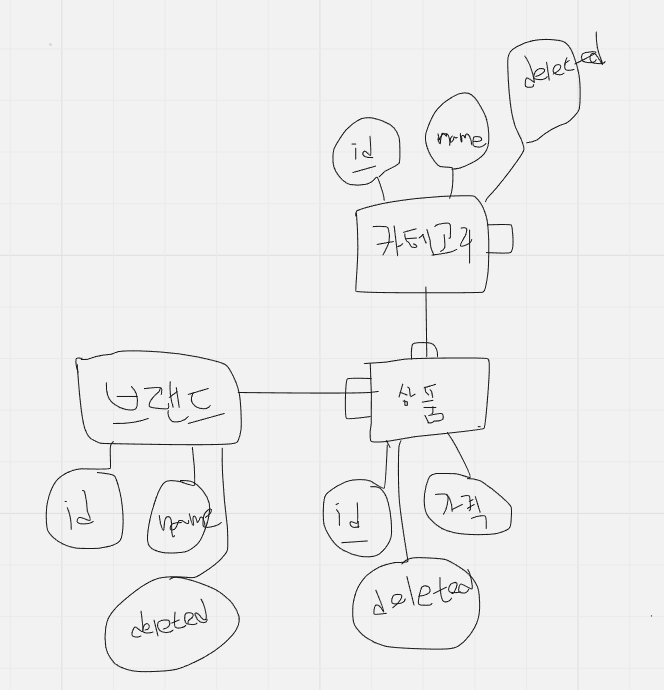

# musinsa-test

## front
front 는 개발하지 못했습니다.

## server

### 빌드 및 실행
* intelliJ 에서 빌드 및 실행
  * kotlin version 1.9.20
    * IntelliJ IDEA 2023.1.x, 2023.2.x, 2023.x
    * jdk 17+
  * 실행파일 - [MusinsaServerApplication.kt](https://github.com/kis6905/musinsa-test/blob/main/server/src/main/kotlin/com/musinsa/server/MusinsaServerApplication.kt)

### 구현
* 구현 1, 2, 3
  * [Link](https://github.com/kis6905/musinsa-test/blob/main/server/src/main/kotlin/com/musinsa/server/application/api/product/ProductApiController.kt)
  * [Test Code](https://github.com/kis6905/musinsa-test/blob/main/server/src/test/kotlin/com/musinsa/server/application/facade/ProductFacadeTest.kt)
* 구현 4
  * [상품 CRUD APIs](https://github.com/kis6905/musinsa-test/blob/main/server/src/main/kotlin/com/musinsa/server/application/admin/product/ProductAdminController.kt)
  * [브랜드 CRUD APIs](https://github.com/kis6905/musinsa-test/blob/main/server/src/main/kotlin/com/musinsa/server/application/admin/brand/BrandAdminController.kt)

* ERD  
  
* Data 초기화
  * [Link](https://github.com/kis6905/musinsa-test/blob/main/server/src/main/kotlin/com/musinsa/server/infra/database/DataInit.kt)

### API 테스트
* Postman 설치
* 다운로드 [postman json file](/docs/musinsa.postman_collection.json)
* Postman 에서 다운로드한 json 파일 import
* server 실행 후 Postmna 으로 테스트
